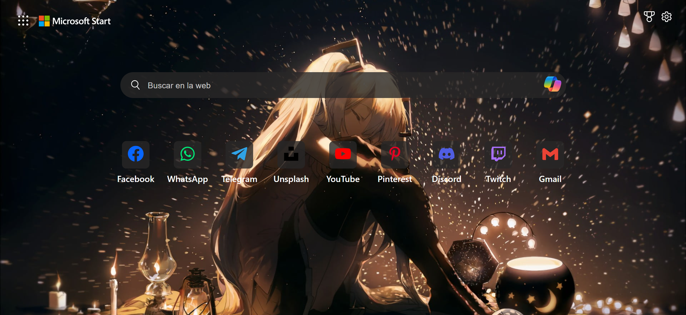
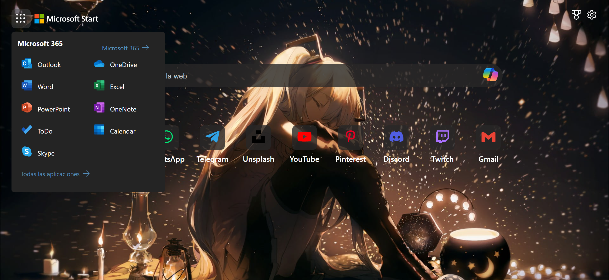

# 📚 Documentación del proyecto: Clon de la interfaz de búsqueda de Microsoft Edge

Continuando con el aprendizaje de HTML, CSS y Javascript. Me propuse intentar replicar la página de búsqueda de Microsoft Edge. Lo hice parecer lo más parecido posible y me tomé la libertad de hacer pequeñas modificaciones a mi gusto personal.

[Versión en inglés](./README.md)

## 📱 Vista móvil

## 🖥️ Vista de escritorio

## 🎨 Estados activos

## 🚀 Tecnologías utilizadas

La pila tecnológica de este proyecto incluye:

- HTML
- CSS
- JavaScript

Para la parte de JavaScript tuve ayuda de Copilot. Le dije lo que tenía en mente y funcionó.

## 🤔 Reflexiones y mejoras

A través de este proyecto, pude identificar áreas de mejora y logros personales:

- Siento que tuve una mejora al nombrar mis clases, aunque intentaré hacerlo mejor.

## 🔗 Enlace al proyecto

[Visita mi proyecto aquí](https://alchrdev.github.io/ms-edge-ui-search/)
