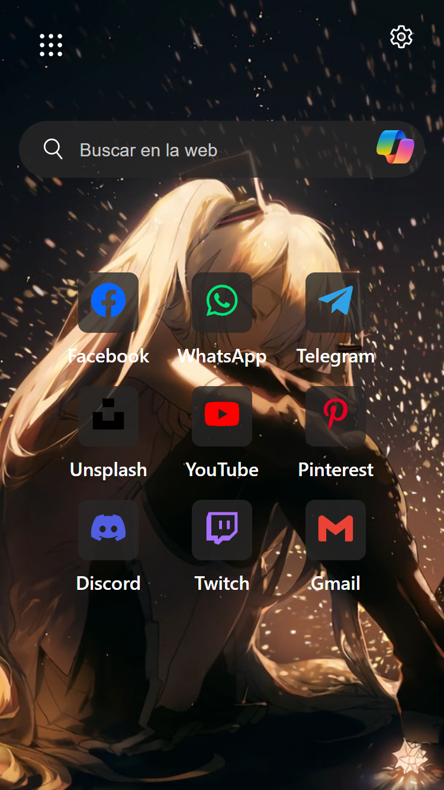
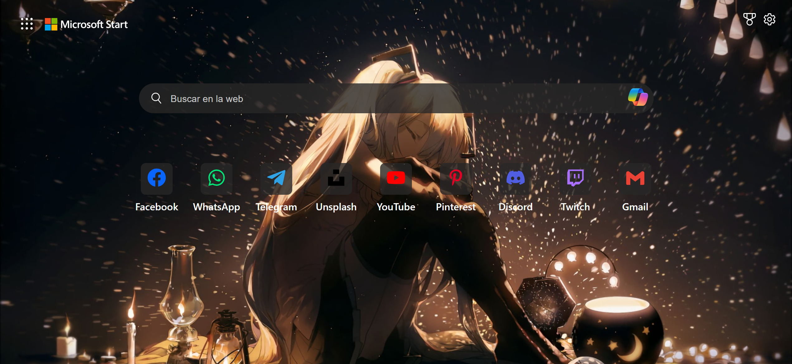
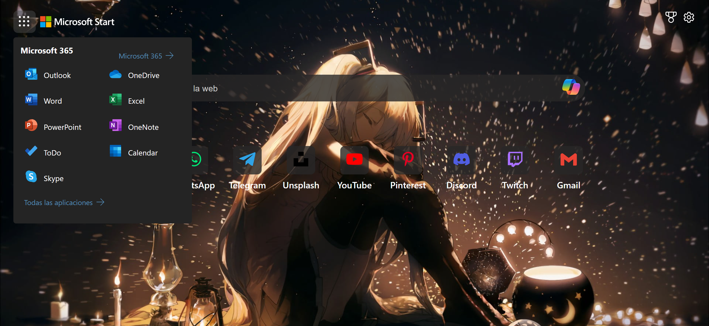

# 📚 Project Documentation: Microsoft Edge Search Interface Clone

Continuing with learning HTML, CSS and Javascript. I set out to try to replicate it from the Microsoft Edge search page. I made it look as much like as possible and took the liberty of making small modifications to my personal taste.

[Spanish version](./README.es.md)

## 📱 Mobile View

## 🖥️ Desktop View

## 🎨 Active states 

## 🚀 Technologies Used

The technology stack of this project includes:

- HTML
- CSS
- JavaScript

For the JavaScript part I had help from Copilot. I told him what I had in mind and it worked.

## 🤔 Reflections and Improvements

Through this project, I was able to identify areas of improvement and personal achievements:

- I feel like I had an improvement when naming my classes, although I will try to do better.

## 🔗 Link to the project

[Visit my project here](https://alchrdev.github.io/ms-edge-ui-search/)
